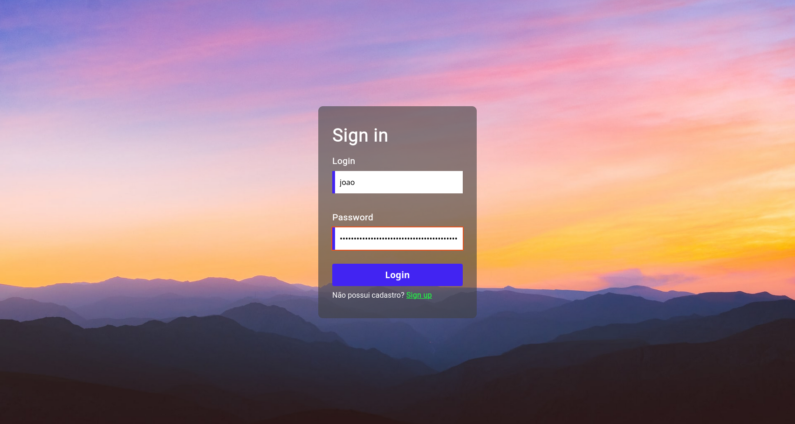
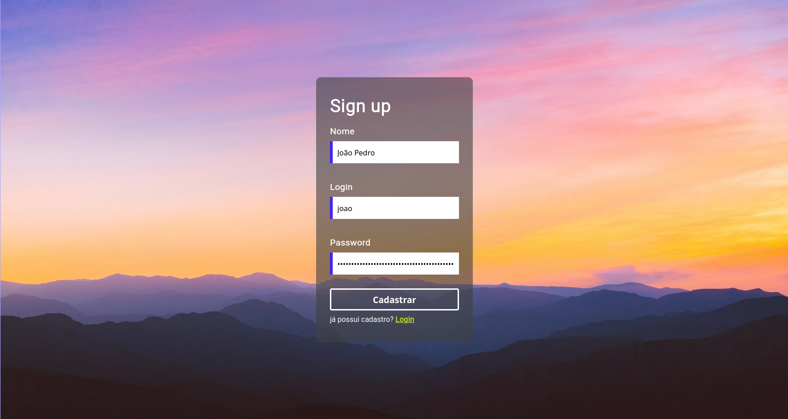
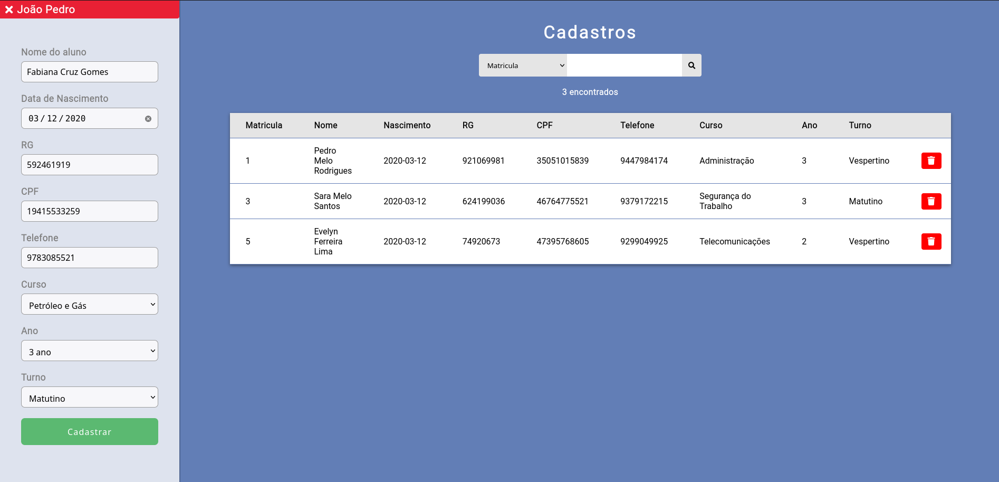

# Laboratório de software

#### Crud simples com uma tela de login

---

```sh
php -S localhost:8000
```

- [SQL](./.github/markdown/sql.md)
- [Sistema de cadastro](./.github/markdown/register.md)

## Todo

- [x] Sistema de cadastro (03 / 08 / 2020)
- [x] Sistema de consulta (04 / 08 / 2020)

---



